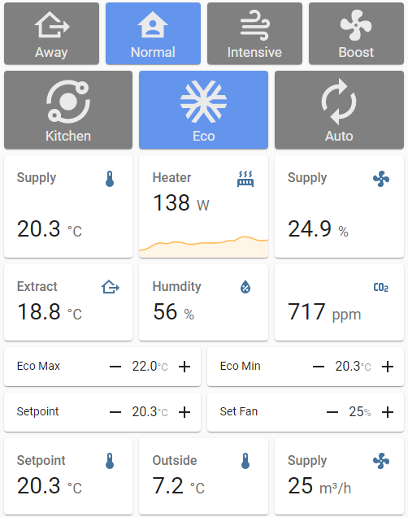
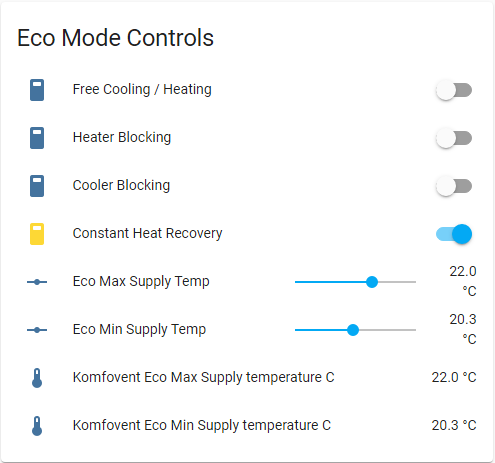
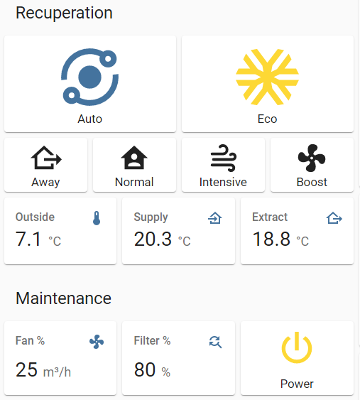

# Komfovent C6 & C6M Home Assistant Package

**Draft under construction**

A file for configuring MODBUS connection to a Komfovent Unit

This uses the Home Assistant 'Package' system.

Add it to your config folder (or a subfolder) - just change the path and include this in your `configuration.yaml` file

```yaml
homeassistant:
  packages:
    komfovent: !include komfovent.yaml
```

Add your IP address and it should just work.

Thanks for th ideas from the [Community Thread](https://community.home-assistant.io/t/modbus-sensor-tcp-for-komfovent/173215)

## Features

### Switches

### Sensors

Where appropriate the sensors all include the correct

* `unit_of_measurement`
* `device_class`
* `state_class`

#### Register decode Sensors

#### Convert to State Value

### Shell Commands

These negate the need for physical relays

* Kitchen Mode
* Fireplace Mode
* Override Mode

### Binary Sensor

Decode register 900

## Lovelace Cards

For the sample cards to work, you need to install this button package https://github.com/custom-cards/button-card

### Main Panel

**Note**: Humidity and CO<sub>2</sub> are from separate sensors.



### Eco Mode



### Recuperation (with power off)


